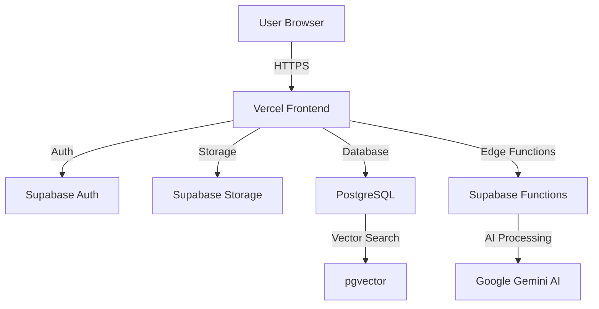

<div align="center">

# 📄 Brief AI Canvas

### Transform Your Documents into Actionable Intelligence

[](https://brief-ai-canvas.vercel.app)
[](https://www.typescriptlang.org/)
[](https://reactjs.org/)
[](https://supabase.com/)
[](https://vitejs.dev/)
[](https://vercel.com/)

**An AI-powered document intelligence platform that transforms your documents into structured, actionable briefs with natural language processing and intelligent summarization.**

[🚀 Live Demo](https://brief-ai-canvas.vercel.app) • [📖 Documentation](#documentation) • [🎯 Features](#features) • [🛠️ Tech Stack](#tech-stack)

</div>

---

## 🎯 Why Brief AI Canvas?

In today's information-heavy world, professionals spend countless hours reading through documents, extracting key insights, and creating actionable summaries. **Brief AI Canvas** solves this by:

- 🤖 **AI-Powered Intelligence**: Automatically analyze and understand document content using Google Gemini AI
- ⚡ **Instant Insights**: Generate structured briefs with summaries, key points, action items, and decisions in seconds
- 💬 **Interactive Q&A**: Ask questions about your documents and get instant, context-aware answers
- 📊 **Smart Organization**: Upload, process, and manage multiple documents with automatic chunking and indexing
- 🎨 **Beautiful UI**: Modern, responsive interface built with React and Tailwind CSS
- ☁️ **Cloud-Powered**: Scalable backend with Supabase for authentication, storage, and real-time data

### 💼 Perfect For:

- **Executives & Managers**: Transform meeting notes into strategic action plans
- **Product Teams**: Extract product requirements and roadmap items from documents
- **Researchers**: Summarize research papers and extract key findings
- **Legal & Compliance**: Analyze contracts and regulatory documents
- **Consultants**: Create client briefs from project documentation
- **Students**: Summarize academic papers and study materials

---

## ✨ Features

### 📤 **Intelligent Document Upload**

- Drag-and-drop file upload with progress tracking
- Support for multiple document formats (PDF, TXT, DOC, DOCX)
- Automatic document processing and text extraction
- Smart chunking for optimal AI processing

### 🧠 **AI-Powered Brief Generation**

- **Automated Summarization**: Generate concise, structured summaries
- **Key Points Extraction**: Identify and highlight critical information
- **Action Items Detection**: Automatically extract actionable tasks
- **Decision Tracking**: Capture key decisions and outcomes
- **Multiple Brief Types**:
  - Q4 Strategic Planning
  - Product Roadmap Review
  - Custom Briefs

### 💬 **AI Chat Interface**

- Ask natural language questions about your documents
- Context-aware responses with source citations
- Multi-document query support
- Conversational interface with chat history
- Powered by Google Gemini AI

### 📊 **Dashboard & Analytics**

- Real-time document processing status
- Brief library with search and filters
- Usage statistics and insights
- Quick action shortcuts
- Recent uploads and briefs

### 🎨 **Modern User Experience**

- Responsive design for all devices
- Dark mode support (coming soon)
- Intuitive navigation and workflows
- Real-time updates and notifications
- Export briefs to PDF and Notion

### 🔐 **Security & Authentication**

- Secure user authentication with Supabase Auth
- Row-level security for data isolation
- Encrypted document storage
- Session management and token handling

---

## 🛠️ Tech Stack

### **Frontend**

- **React 18** - Modern UI library
- **TypeScript** - Type-safe development
- **Vite** - Lightning-fast build tool
- **Tailwind CSS** - Utility-first styling
- **shadcn/ui** - Beautiful, accessible components
- **React Query** - Powerful data fetching and caching
- **React Router** - Client-side routing

### **Backend & Infrastructure**

- **Supabase** - Backend-as-a-Service platform
  - PostgreSQL database with Row-Level Security
  - Authentication and user management
  - Cloud storage for documents
  - Edge Functions for serverless compute
- **Google Gemini AI** - Advanced language model
- **Vercel** - Deployment and hosting

### **Key Libraries**

- `@supabase/supabase-js` - Supabase client
- `@tanstack/react-query` - Server state management
- `react-hook-form` - Form handling
- `date-fns` - Date formatting
- `lucide-react` - Beautiful icons
- `html2canvas` - PDF export
- `zod` - Schema validation

---

## 🚀 Getting Started

### Prerequisites

- **Node.js** 18+ and npm ([install with nvm](https://github.com/nvm-sh/nvm))
- **Supabase Account** ([sign up free](https://supabase.com))
- **Google Gemini API Key** ([get one free](https://makersuite.google.com/app/apikey))

### Installation

1. **Clone the repository**

   ```bash
   git clone https://github.com/cristonpinto/brief-ai-canvas.git
   cd brief-ai-canvas
   ```

2. **Install dependencies**

   ```bash
   npm install
   ```

3. **Set up environment variables**

   ```bash
   cp .env.example .env
   ```

   Edit `.env` with your credentials:

   ```env
   VITE_SUPABASE_URL=your-supabase-url
   VITE_SUPABASE_ANON_KEY=your-supabase-anon-key
   ```

4. **Set up Supabase**

   Run the database migrations:

   ```bash
   # In Supabase SQL Editor, run:
   supabase/complete-database-setup.sql
   ```

5. **Deploy Edge Functions**

   ```bash
   # Deploy AI Chat function
   supabase functions deploy ai-chat --no-verify-jwt

   # Deploy Document Processing function
   supabase functions deploy process-document --no-verify-jwt

   # Deploy Brief Generation function
   supabase functions deploy generate-brief --no-verify-jwt
   ```

   Set the Google Gemini API key:

   ```bash
   supabase secrets set GOOGLE_GEMINI_API_KEY=your-api-key-here
   ```

6. **Start the development server**

   ```bash
   npm run dev
   ```

   Open [http://localhost:8082](http://localhost:8082) in your browser 🎉

---

## 📖 Usage Guide

### 1️⃣ **Upload Documents**

Navigate to the **Upload** page and drag-and-drop your documents or click to browse. The system will:

- Upload files to secure cloud storage
- Extract text content
- Create searchable chunks
- Make documents ready for AI processing

### 2️⃣ **Ask AI Questions**

Go to **Ask AI** page:

1. Select one or more documents
2. Type your question in natural language
3. Get instant, context-aware answers with source citations

**Example Questions:**

- "What are the main action items from this meeting?"
- "Summarize the key decisions made"
- "What are the budget requirements mentioned?"

### 3️⃣ **Generate Briefs**

Visit the **Brief Generator** page:

1. Select documents to analyze
2. Choose a brief type (Strategic Planning, Product Roadmap, or Custom)
3. Click "Generate Brief"
4. Edit and customize the generated cards
5. Save to your library or export to PDF/Notion

**Generated Brief Sections:**

- 📝 **Summary** - High-level overview
- 🎯 **Key Points** - Critical insights
- ✅ **Action Items** - Tasks and responsibilities
- 💡 **Decisions** - Key outcomes and determinations

### 4️⃣ **Manage Your Briefs**

Access saved briefs from:

- **Dashboard** - Recent briefs overview
- **Brief Library** - Full searchable collection
- Quick actions for viewing, editing, and exporting

---

## 🏗️ Project Structure

```
brief-ai-canvas/
├── src/
│   ├── components/          # Reusable React components
│   │   ├── ui/             # shadcn/ui components
│   │   ├── AppSidebar.tsx  # Navigation sidebar
│   │   └── DashboardLayout.tsx
│   ├── pages/              # Route pages
│   │   ├── Dashboard.tsx   # Main dashboard
│   │   ├── Upload.tsx      # Document upload
│   │   ├── AskAI.tsx       # AI chat interface
│   │   ├── BriefGenerator.tsx # Brief creation
│   │   └── Auth.tsx        # Authentication
│   ├── hooks/              # Custom React hooks
│   │   ├── useBriefs.ts    # Brief management
│   │   └── useDocuments.ts # Document operations
│   ├── contexts/           # React contexts
│   │   └── AuthContext.tsx # Auth state management
│   ├── integrations/       # External services
│   │   └── supabase/       # Supabase client & types
│   └── lib/                # Utilities
│       └── utils.ts
├── supabase/
│   ├── functions/          # Edge Functions
│   │   ├── ai-chat/        # AI chat endpoint
│   │   ├── process-document/ # Document processing
│   │   └── generate-brief/ # Brief generation
│   └── migrations/         # Database migrations
├── public/                 # Static assets
└── package.json
```

---

## 🌐 Deployment

### Deploy to Vercel (Recommended)

1. **Push to GitHub**

   ```bash
   git push origin main
   ```

2. **Import to Vercel**

   - Go to [vercel.com/new](https://vercel.com/new)
   - Select your repository
   - Configure environment variables:
     - `VITE_SUPABASE_URL`
     - `VITE_SUPABASE_ANON_KEY`
   - Click **Deploy**

3. **Configure Supabase**
   - Add your Vercel URL to Supabase Auth settings
   - Update Site URL and Redirect URLs

📚 See [DEPLOYMENT.md](./DEPLOYMENT.md) for detailed instructions.

---

## 📊 Architecture



### Data Flow

1. **Document Upload** → Storage → Database record created
2. **Processing** → Edge Function extracts text → Creates chunks with embeddings
3. **AI Chat** → Retrieves relevant chunks → Sends to Gemini → Returns answer
4. **Brief Generation** → Aggregates chunks → Structures with AI → Saves to database

---

## 🔧 Configuration

### Environment Variables

| Variable                 | Description               | Required |
| ------------------------ | ------------------------- | -------- |
| `VITE_SUPABASE_URL`      | Your Supabase project URL | ✅ Yes   |
| `VITE_SUPABASE_ANON_KEY` | Supabase anonymous key    | ✅ Yes   |

### Supabase Secrets (Edge Functions)

| Secret                  | Description               | Required |
| ----------------------- | ------------------------- | -------- |
| `GOOGLE_GEMINI_API_KEY` | Google Gemini API key     | ✅ Yes   |
| `SUPABASE_URL`          | Auto-provided by Supabase | ✅ Auto  |
| `SUPABASE_ANON_KEY`     | Auto-provided by Supabase | ✅ Auto  |

---

## 🤝 Contributing

We welcome contributions! Here's how you can help:

1. Fork the repository
2. Create a feature branch (`git checkout -b feature/amazing-feature`)
3. Commit your changes (`git commit -m 'Add amazing feature'`)
4. Push to the branch (`git push origin feature/amazing-feature`)
5. Open a Pull Request

---

## 📝 License

This project is licensed under the MIT License - see the [LICENSE](LICENSE) file for details.

---

## 🙏 Acknowledgments

- **Google Gemini** for powerful AI capabilities
- **Supabase** for amazing backend infrastructure
- **shadcn/ui** for beautiful component library
- **Vercel** for seamless deployment
- **Lovable** for the initial project structure

---

## 📞 Support & Contact

- **Live Demo**: [https://brief-ai-canvas.vercel.app](https://brief-ai-canvas.vercel.app)
- **Issues**: [GitHub Issues](https://github.com/cristonpinto/brief-ai-canvas/issues)
- **Discussions**: [GitHub Discussions](https://github.com/cristonpinto/brief-ai-canvas/discussions)

---

<div align="center">

**Made with ❤️ by [Criston Pinto](https://github.com/cristonpinto)**

⭐ Star this repo if you find it helpful!

</div>
